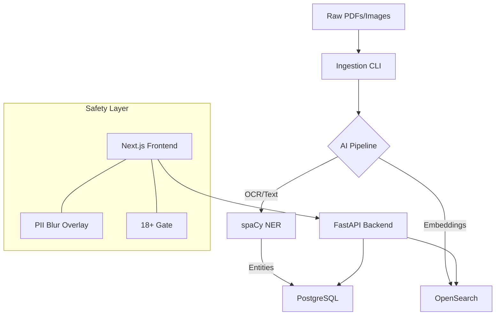

# 📁 VAULT: EPSTEIN — Public Record Investigation Platform


> **"The truth is in the data."**
> An advanced, open-source investigative platform designed to explore 3.5M+ pages of the Jeffrey Epstein document releases. Built for researchers, journalists, and the public.

---

## 🛠 Features

- **🔍 Page-Level Hybrid Search**: Combines BM25 and Vector search to find needles in a haystack of millions of pages.
- **🛡️ Aggressive PII Masking**: Automated sanitization of emails, phone numbers, and addresses.
- **🌍 Global Intelligence**: Automatically maps locations to countries to identify regional patterns.
- **🕵️ Entity Extraction**: High-speed NER (Named Entity Recognition) identifying the people, organizations, and events mentioned.
- **🔞 Safe Access**: Integrated 18+ verification gate and sensitive content disclaimers.

---

## 🏗 System Architecture



---

## 🚀 Quick Start

### 1. Requirements
- Docker & Docker Compose
- 8GB+ RAM Recommended

### 2. Launch
```bash
git clone https://github.com/peromero-creater/VAULT-EPSTEIN.git
cd VAULT-EPSTEIN
docker-compose up -d
```

### 3. Ingest Data
Drop your document files into `./data/files` and start the processor:
```bash
docker-compose exec api python /app/ingestion/main.py
```

---

## 🛡 Safety & Compliance

This platform is for **investigative purposes only**. It automatically masks PII to protect privacy while maintaining the historical integrity of the public record. 

- **Emails**: Replaced with `[EMAIL]`
- **Phones**: Replaced with `[PHONE]`
- **Addresses**: Replaced with `[ADDRESS]`

---

## 🔗 Credits
Built for the community. Share the truth.
#EpsteinFiles #OpenSource #Investigation
